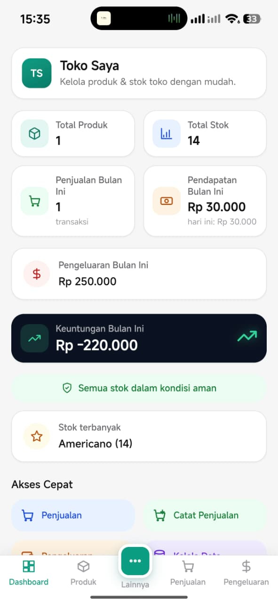
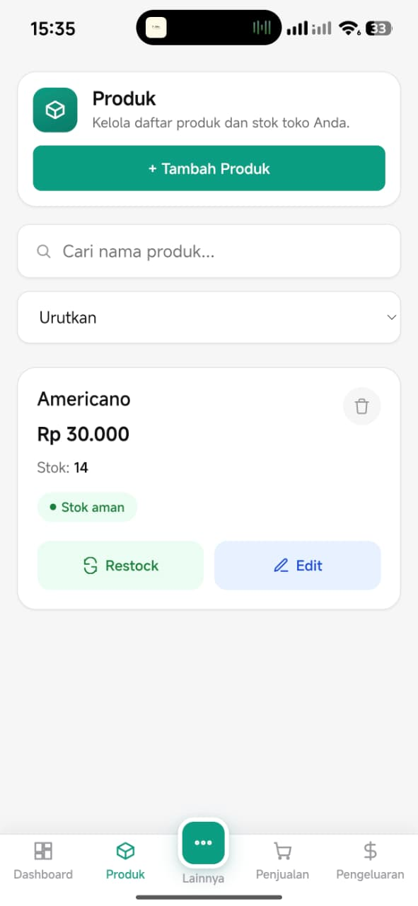
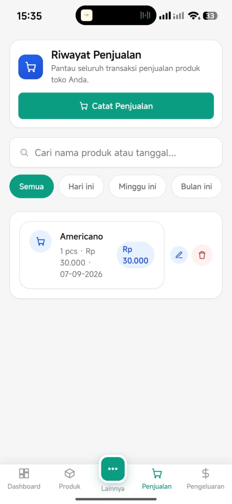
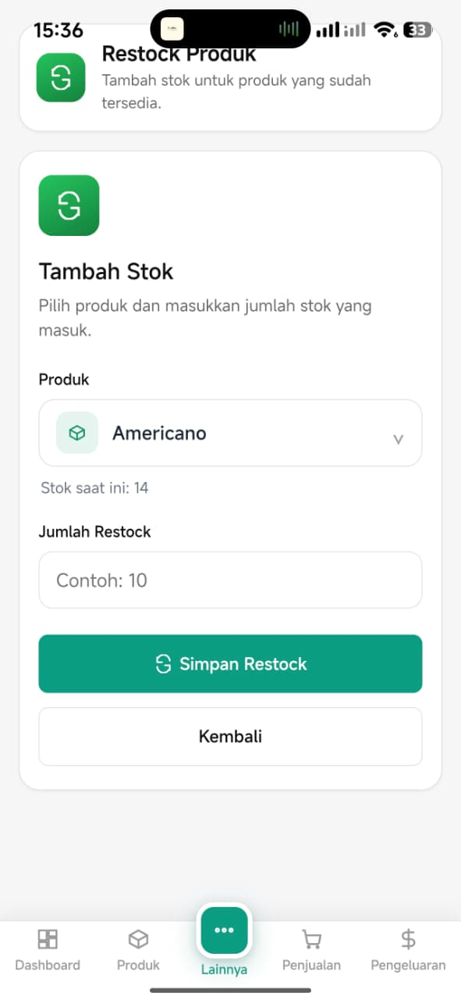
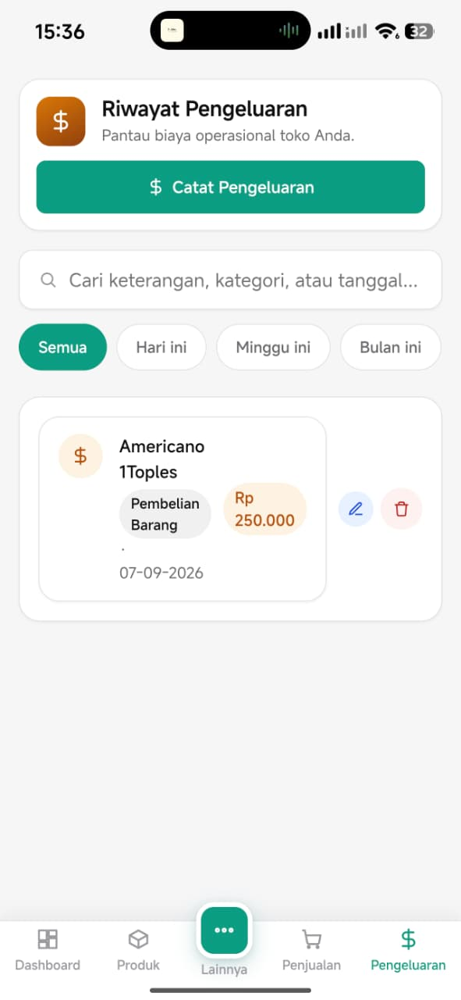
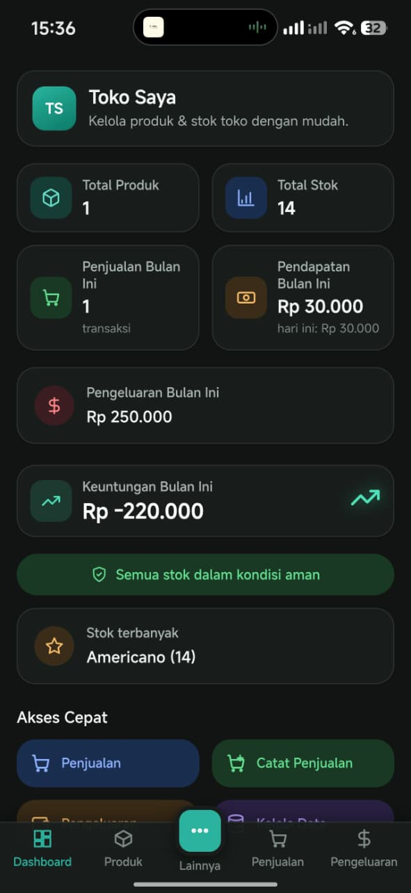

# Toko Saya

> Aplikasi Kasir dan Manajemen Stok Android Offline berbasis Laravel dan NativePHP.

Toko Saya adalah aplikasi kasir dan manajemen stok yang saya buat untuk membantu pencatatan operasional toko sehari-hari.

Aplikasi ini mencakup pengelolaan produk, penjualan, restock, pengeluaran, laporan bulanan, dan backup data. Fokus utama project ini adalah membuat aplikasi yang tetap dapat digunakan secara offline di Android.

Saya membangun project ini sambil mempelajari dan menerapkan Laravel, SQLite, Blade, JavaScript, testing, serta integrasi NativePHP dengan Android.

---

## Mengapa Saya Membuat Aplikasi Ini

Saya ingin membuat aplikasi kasir sederhana yang tidak bergantung pada koneksi internet untuk penggunaan sehari-hari.

Selama mengembangkan Toko Saya, saya fokus pada penyimpanan data lokal, pencatatan transaksi, pengelolaan stok, backup data, serta pengalaman penggunaan di perangkat mobile.

---

## Fitur

### Dashboard

- Ringkasan kondisi toko
- Informasi penjualan
- Pengeluaran
- Stok dan aktivitas utama

### Pengelolaan Produk

- Tambah produk
- Edit produk
- Hapus produk
- Informasi harga dan stok
- Pencarian produk

### Penjualan

- Pencatatan transaksi penjualan
- Pemilihan produk dengan product picker
- Pencarian produk
- Perhitungan total transaksi
- Validasi stok
- Format harga Rupiah

### Restock

- Menambah stok produk
- Pemilihan produk dengan product picker
- Pencarian produk
- Riwayat restock

### Pengeluaran

- Pencatatan pengeluaran
- Kategori pengeluaran
- Catatan pengeluaran
- Format nominal Rupiah
- Edit dan hapus pengeluaran

### Laporan Bulanan

- Laporan penjualan
- Laporan pengeluaran
- Laporan restock
- Ringkasan hasil bersih
- Status untung/rugi

### Backup Data

- Arsip backup berdasarkan bulan
- Backup dalam format JSON
- Laporan dalam format TXT
- Perlindungan terhadap duplikasi data
- UUID stabil untuk data penting
- Pengelolaan data lokal

### Antarmuka Pengguna

- Antarmuka responsif untuk perangkat mobile
- Navigasi bawah khusus mobile
- Product picker dengan pencarian
- Pencarian produk
- Mode terang
- Mode gelap
- Sinkronisasi tema system bar Android

### Penggunaan Offline

- SQLite sebagai database lokal
- Penggunaan utama tidak membutuhkan koneksi internet
- Data tersimpan secara lokal pada perangkat

---

## Teknologi yang Digunakan

| Teknologi | Penggunaan |
|---|---|
| PHP 8.4 | Backend |
| Laravel 13 | Kerangka aplikasi |
| SQLite | Database lokal |
| Blade | Antarmuka berbasis server |
| JavaScript | Interaksi antarmuka |
| CSS | Tampilan responsif |
| NativePHP Mobile | Integrasi Android |
| Kotlin | Integrasi Android native |
| Vite | Pembuatan aset frontend |
| Pest / PHPUnit | Pengujian otomatis |

---

## Arsitektur

Aplikasi menggunakan pendekatan offline-first.

```text
Android App
|
+-- NativePHP
|   |
|   +-- Native Android Layer
|
+-- Laravel
    |
    +-- Controllers
    +-- Services
    +-- Models
    +-- Blade Views
    +-- SQLite
```

Data utama aplikasi disimpan secara lokal sehingga fitur utama tetap dapat digunakan tanpa koneksi internet.

---

## Tangkapan Layar

<p align="center">
  
  
  
</p>

<p align="center">
  
  
  
</p>

---

## Pengujian

Aplikasi memiliki pengujian otomatis untuk memvalidasi fitur-fitur utama.

Status pengujian terakhir:

```text
48 pengujian berhasil
197 assertions
```

Pengujian mencakup:

- Pengelolaan produk
- Penjualan
- Restock
- Pengeluaran
- Laporan bulanan
- Backup data
- UUID data
- Backup otomatis
- Pengelolaan arsip backup

---

## Android

Aplikasi dikemas menjadi APK Android menggunakan NativePHP Mobile.

```text
Android API 36
```

Package:

```text
com.rizky.cloudsummitquasar
```

---

## Hal yang Saya Fokuskan

### Offline-first

Saya merancang aplikasi agar fitur utama tetap dapat digunakan tanpa koneksi internet dan data utama tersimpan secara lokal.

### Backup Data

Saya membuat sistem backup bulanan dengan arsip JSON dan laporan TXT agar data toko dapat disimpan secara teratur.

### UUID Stabil

UUID digunakan untuk menjaga identitas data tetap konsisten pada data penting aplikasi.

### Product Picker Mobile

Saya membuat product picker dengan fitur pencarian agar pemilihan produk tetap nyaman ketika jumlah produk bertambah.

### Navigasi Mobile

Saya membuat navigasi khusus mobile untuk memudahkan perpindahan antar fitur utama aplikasi.

### Mode Terang dan Gelap

Saya menambahkan mode terang dan gelap serta menyesuaikan tampilan system bar Android agar tema aplikasi tetap konsisten.

---

## Instalasi

Clone repository:

```bash
git clone https://github.com/morijin0012/toko-saya.git
cd toko-saya
```

Pasang dependensi PHP:

```bash
composer install
```

Pasang dependensi frontend:

```bash
npm install
```

Salin file environment:

```bash
cp .env.example .env
```

Buat application key:

```bash
php artisan key:generate
```

Jalankan migration database:

```bash
php artisan migrate
```

Bangun aset frontend:

```bash
npm run build
```

---

## Menjalankan Aplikasi

Jalankan server Laravel:

```bash
php artisan serve
```

Untuk pengembangan frontend:

```bash
npm run dev
```

---

## Membuat APK Android

Aplikasi dapat dikemas menjadi APK Android menggunakan NativePHP Mobile.

```bash
php artisan native:package android --build-type=release
```

---

## Struktur Project

```text
app/
├── Http/
├── Models/
├── Services/
└── Providers/

database/
├── migrations/
└── seeders/

resources/
├── css/
├── js/
└── views/

routes/
└── web.php

tests/
├── Feature/
└── Unit/

nativephp/
└── android/

screenshots/
├── dashboard.jpeg
├── products.jpeg
├── sales.jpeg
├── restock.jpeg
├── expenses.jpeg
└── dark-mode.jpeg
```

---

## Pengembangan Berikutnya

Pengembangan berikutnya akan menyesuaikan masukan dari orang yang menggunakan atau mencoba aplikasi ini.

Beberapa hal yang ingin saya perhatikan:

- Perbaikan tampilan dan pengalaman penggunaan
- Penyederhanaan alur transaksi
- Penyesuaian berdasarkan masukan pengguna
- Penyempurnaan fitur yang sudah ada
- Penambahan fitur yang benar-benar dibutuhkan pengguna

---

## Pembuat

**Rizky**

Project pribadi yang saya buat untuk belajar, bereksperimen, dan meningkatkan kemampuan dalam Laravel, pengembangan aplikasi mobile, dan rekayasa perangkat lunak.

---

## Lisensi

Project ini menggunakan MIT License.